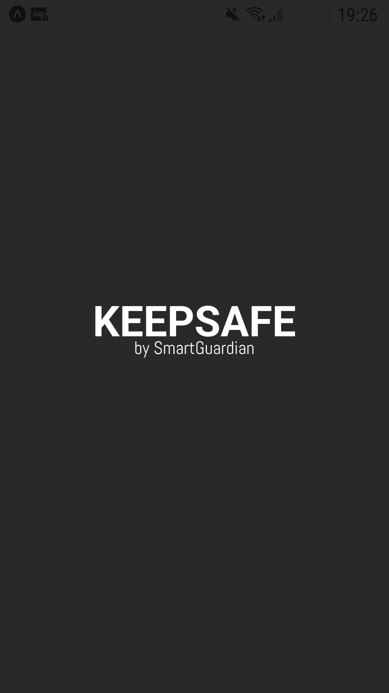
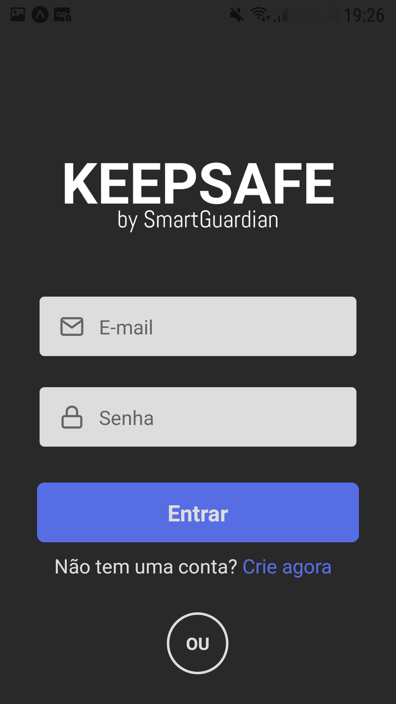
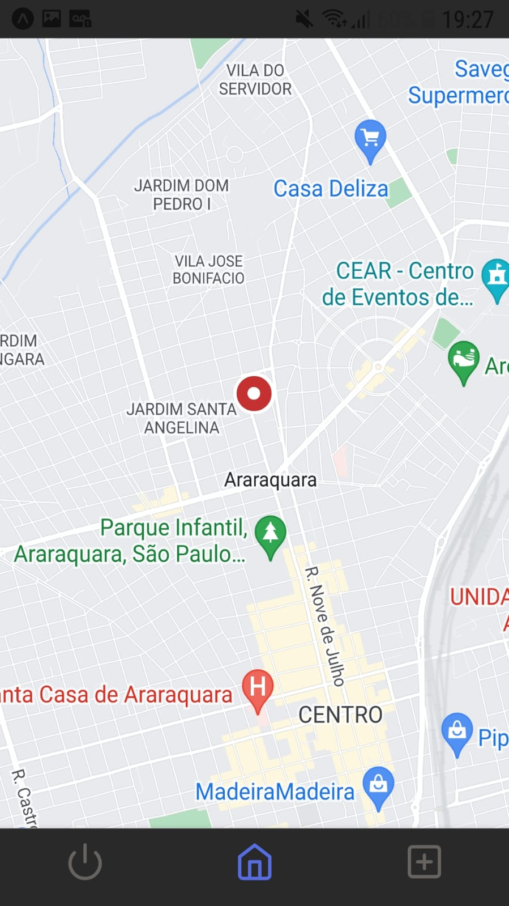
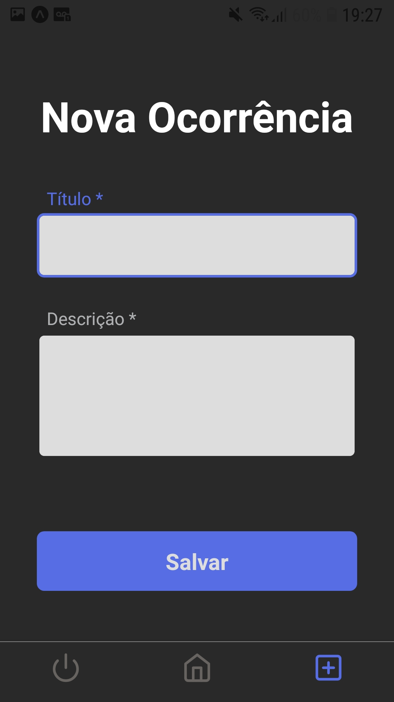
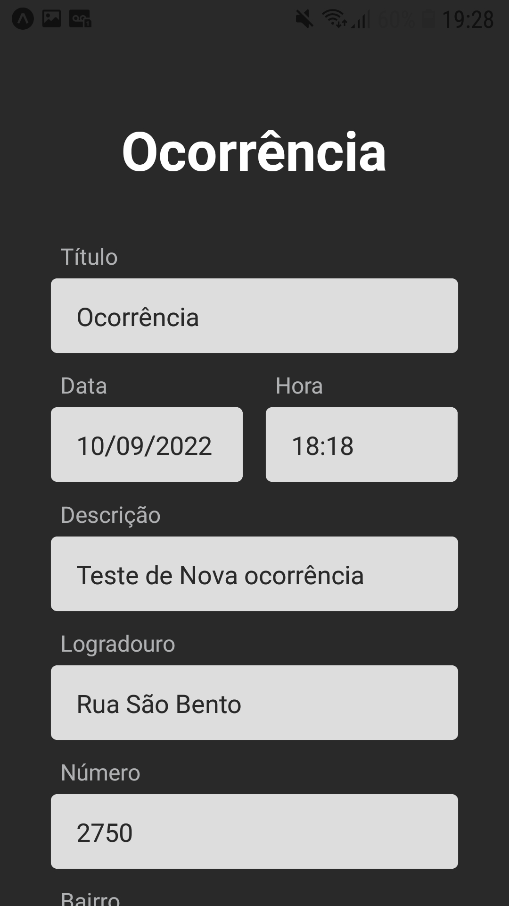

<div align="right" >
  <p>
  ꜥꜤ  应用程序 ❛.⌇ <br>____________________
  </p>
  
  <a href="https://github.com/LlynS2/KeepSafe_Prototype">° ➺ 𝑹𝒆𝒍𝒂𝒕𝒆𝒅 𝑹𝒆𝒑𝒐𝒔𝒊𝒕𝒐𝒓𝒊𝒆𝒔 : 𝑲𝒆𝒆𝒑𝑺𝒂𝒇𝒆_𝑷𝒓𝒐𝒕𝒐𝒕𝒚𝒑𝒆 ˎˊ˗ ࿐°</a>  
  
</div>  
 
 <div align="left" >
  <br><br>
  
  <p align="left">
    𝙺𝚎𝚎𝚙𝚂𝚊𝚏𝚎 𝚒𝚜 𝚊 𝚙𝚛𝚘𝚓𝚎𝚌𝚝 𝚍𝚎𝚟𝚎𝚕𝚘𝚙𝚎𝚍 𝚋𝚢 𝚝𝚑𝚎 𝚜𝚝𝚊𝚛𝚝𝚞𝚙 ( 𝚏𝚒𝚌𝚝𝚒𝚘𝚗𝚊𝚕 𝚏𝚘𝚛 𝚌𝚘𝚕𝚕𝚎𝚐𝚎 ) 𝚂𝚖𝚊𝚛𝚝𝙶𝚞𝚊𝚛𝚍𝚒𝚊𝚗, 𝚒𝚗 𝚠𝚑𝚒𝚌𝚑 𝚠𝚎 𝚍𝚎𝚟𝚎𝚕𝚘𝚙 𝚚𝚞𝚒𝚌𝚔 𝚝𝚘𝚘𝚕𝚜 𝚝𝚘 𝚒𝚖𝚙𝚛𝚘𝚟𝚎 𝚊𝚗𝚍 𝚒𝚗𝚌𝚛𝚎𝚊𝚜𝚎𝚜𝚎𝚌𝚞𝚛𝚒𝚝𝚢 
    𝚒𝚗 𝚌𝚒𝚝𝚒𝚎𝚜 𝚋𝚢 𝚊𝚙𝚙𝚕𝚢𝚒𝚗𝚐 𝚝𝚑𝚎 𝚂𝚖𝚊𝚛𝚝𝙲𝚒𝚝𝚢 𝚌𝚘𝚗𝚌𝚎𝚙𝚝.<br>
  <p align="center">
    𝚆𝚒𝚝𝚑 𝚘𝚞𝚛 𝚊𝚙𝚙𝚕𝚒𝚌𝚊𝚝𝚒𝚘𝚗, 𝚒𝚝 𝚒𝚜 𝚙𝚘𝚜𝚜𝚒𝚋𝚕𝚎 𝚏𝚘𝚛 𝚝𝚑𝚎 𝚞𝚜𝚎𝚛 𝚝𝚘 𝚔𝚗𝚘𝚠 𝚠𝚑𝚎𝚛𝚎 𝚊 𝚛𝚒𝚜𝚔 𝚜𝚒𝚝𝚞𝚊𝚝𝚒𝚘𝚗 𝚒𝚜 𝚘𝚌𝚌𝚞𝚛𝚛𝚒𝚗𝚐 𝚊𝚗𝚍 𝚝𝚘 𝚊𝚟𝚘𝚒𝚍 𝚒𝚝, 
    𝚊𝚜 𝚠𝚎𝚕𝚕 𝚊𝚜, 𝚒𝚏 𝚝𝚑𝚎𝚛𝚎 𝚒𝚜 𝚊 𝚜𝚒𝚝𝚞𝚊𝚝𝚒𝚘𝚗 𝚠𝚒𝚝𝚑 𝚝𝚑𝚎 𝚞𝚜𝚎𝚛 𝚑𝚒𝚖𝚜𝚎𝚕𝚏, 𝚑𝚎 𝚠𝚒𝚕𝚕 𝚋𝚎 𝚊𝚋𝚕𝚎 𝚝𝚘 𝚌𝚘𝚗𝚝𝚊𝚌𝚝 𝚝𝚑𝚎 𝚊𝚞𝚝𝚑𝚘𝚛𝚒𝚝𝚒𝚎𝚜 𝚚𝚞𝚒𝚌𝚔𝚕𝚢, 𝚘𝚙𝚎𝚗𝚒𝚗𝚐 𝚊𝚗 𝚘𝚌𝚌𝚞𝚛𝚛𝚎𝚗𝚌𝚎 𝚒𝚗 𝚝𝚑𝚎 𝚊𝚙𝚙𝚕𝚒𝚌𝚊𝚝𝚒𝚘𝚗 
    𝚒𝚝𝚜𝚎𝚕𝚏 𝚝𝚑𝚊𝚝 𝚠𝚒𝚕𝚕 𝚊𝚕𝚛𝚎𝚊𝚍𝚢 𝚒𝚗𝚍𝚒𝚌𝚊𝚝𝚎 𝚑𝚒𝚜 𝚕𝚘𝚌𝚊𝚝𝚒𝚘𝚗.
   </p> 
  </p><br>
  
  </div>
  
  <div align="center"> 
   

   

   

   

   
 </div><br>

 <div align="right" >
  <h3>☇ 𝕋𝕖𝕔𝕙𝕟𝕠𝕝𝕠𝕘𝕚𝕖𝕤 ❜</h3>
  <p>𝚃𝚑𝚎 𝚖𝚊𝚒𝚗 𝚝𝚎𝚌𝚑𝚗𝚘𝚕𝚘𝚐𝚒𝚎𝚜 𝚞𝚜𝚎𝚍:</p>
  
   <table>
     <tr>
          <td>✅</td>
          <td><a href="https://reactnative.dev/">𝐑𝐞𝐚𝐜𝐭 𝐍𝐚𝐭𝐢𝐯𝐞</a></td>
          <td>✅</td>
          <td><a href="https://docs.expo.dev/">𝐄𝐱𝐩𝐨</a></td>
      </tr>
      <tr>
          <td>✅</td>
          <td><a href="https://react-hook-form.com/">𝐑𝐞𝐚𝐜𝐭 𝐇𝐨𝐨𝐤 𝐅𝐨𝐫𝐦</a></td>
          <td>✅</td>
          <td><a href="https://github.com/react-native-maps/react-native-maps">𝐑𝐞𝐚𝐜𝐭 𝐍𝐚𝐭𝐢𝐯𝐞 𝐌𝐚𝐩𝐬</a></td>
      </tr>
      <tr>
          <td>✅</td>
          <td><a href="https://firebase.google.com/">𝐅𝐢𝐫𝐞𝐛𝐚𝐬𝐞</a></td>
          <td>✅</td>
          <td><a href="https://styled-components.com/">𝐒𝐭𝐲𝐥𝐞𝐝-𝐂𝐨𝐦𝐩𝐨𝐧𝐞𝐧𝐭𝐬</a></td>
      </tr>
      
   </table>
</div>
 
 <div>
  <h3>☇ ℙ𝕣𝕖𝕣𝕖𝕢𝕦𝕚𝕤𝕚𝕥𝕖𝕤 ❜</h3>
  <p>

😁👉 <a href="https://nodejs.org/en/">𝐍𝐨𝐝𝐞𝐉𝐒 𝐋𝐓𝐒</a>

𝑰𝒏𝒔𝒕𝒂𝒍𝒍 𝒕𝒉𝒆 𝑬𝒙𝒑𝒐 𝑮𝒐 𝑨𝒑𝒑𝒍𝒊𝒄𝒂𝒕𝒊𝒐𝒏 :

<table>
     <tr>
          <td></td>
          <td><a href="https://play.google.com/store/apps/details?id=host.exp.exponent">𝐀𝐧𝐝𝐫𝐨𝐢𝐝</a></td>
          <td>𝐨𝐫</td>
          <td></td>
          <td><a href="https://apps.apple.com/app/expo-go/id982107779">𝐈𝐎𝐒</a></td>
      </tr>
   </table>

  <p>𝑹𝒆𝒄𝒐𝒎𝒎𝒆𝒏𝒅𝒂𝒕𝒊𝒐𝒏 :</p>

  <table>
     <tr>
          <td></td>
          <td><a href="https://code.visualstudio.com/download">𝐕𝐒 𝐂𝐨𝐝𝐞</a></td>
          <td></td>
          <td><a href="https://classic.yarnpkg.com/en/docs/install#mac-stable">𝐘𝐚𝐫𝐧</a></td>
      </tr>
   </table>
</div>

<div align="center" >
  <h3>☇ ℍ𝕠𝕨 𝕥𝕠 𝕣𝕦𝕟? ❜</h3>
</div>

<div>
<p>𝟙. 𝙲𝚕𝚘𝚗𝚎 𝚝𝚑𝚎 𝚙𝚛𝚘𝚓𝚎𝚌𝚝 𝚊𝚗𝚍 𝚊𝚌𝚌𝚎𝚜𝚜 𝚝𝚑𝚎 𝚏𝚘𝚕𝚍𝚎𝚛</p>

```sh
$ git clone https://github.com/LlynS2/KeepSafe_APP.git
$ cd KeepSafe_APP
```

<p>𝟚. 𝙲𝚘𝚗𝚏𝚒𝚐𝚞𝚛𝚎 𝚝𝚑𝚎 𝚎𝚗𝚟𝚒𝚛𝚘𝚗𝚖𝚎𝚗𝚝 𝚟𝚊𝚛𝚒𝚊𝚋𝚕𝚎𝚜</p> 

```sh
$ cp .env.example .env
```

<p>𝟛. 𝚂𝚝𝚊𝚛𝚝𝚒𝚗𝚐 𝚝𝚑𝚎 𝚊𝚙𝚙𝚕𝚒𝚌𝚊𝚝𝚒𝚘𝚗</p>  

```sh
# Install the dependencies
$ yarn
# or
$ npm install

# Start the application
$ npx expo start
```
</div><br>

<div>
<h3>» 𝕆𝕡𝕖𝕟𝕚𝕟𝕘 𝕥𝕙𝕖 𝔸𝕡𝕡 𝕠𝕟 𝕪𝕠𝕦𝕣 𝕔𝕖𝕝𝕝𝕡𝕙𝕠𝕟𝕖 📱 ˎˊ˗ ࿐°</h3>
<p>
 👉 𝙾𝚗 𝚢𝚘𝚞𝚛 𝙸𝚙𝚑𝚘𝚗𝚎, 𝚘𝚙𝚎𝚗 𝚝𝚑𝚎 𝚍𝚎𝚏𝚊𝚞𝚕𝚝 𝚌𝚊𝚖𝚎𝚛𝚊 𝚊𝚗𝚍 𝚜𝚌𝚊𝚗 𝚝𝚑𝚎 𝚀𝚁 𝙲𝚘𝚍𝚎 𝚝𝚑𝚊𝚝 𝚊𝚙𝚙𝚎𝚊𝚛𝚎𝚍 𝚘𝚗 𝚝𝚑𝚎 𝚝𝚎𝚛𝚖𝚒𝚗𝚊𝚕;<br>
 👉 𝙾𝚗 𝚢𝚘𝚞𝚛 𝙰𝚗𝚍𝚛𝚘𝚒𝚍 𝚍𝚎𝚟𝚒𝚌𝚎, 𝚘𝚙𝚎𝚗 𝚝𝚑𝚎 𝙴𝚡𝚙𝚘 𝙶𝚘 𝚊𝚙𝚙 𝚊𝚗𝚍 𝚙𝚛𝚎𝚜𝚜 "𝚂𝚌𝚊𝚗 𝚀𝚁 𝙲𝚘𝚍𝚎" 𝚒𝚗 𝚝𝚑𝚎 𝙷𝚘𝚖𝚎 𝚝𝚊𝚋 𝚊𝚗𝚍 𝚜𝚌𝚊𝚗 𝚝𝚑𝚎 𝚀𝚁 𝙲𝚘𝚍𝚎 𝚝𝚑𝚊𝚝 𝚊𝚙𝚙𝚎𝚊𝚛𝚎𝚍 𝚒𝚗 𝚝𝚑𝚎 𝚝𝚎𝚛𝚖𝚒𝚗𝚊𝚕.
</p>
</div><br>

<div align="center">
  
  <p><sup>𝙱𝚢 <b>𝐒𝐦𝐚𝐫𝐭𝐆𝐮𝐚𝐫𝐝𝐢𝐚𝐧</b><sup></p>
</div>
 
 <div>
   <p>
     ____________________<br> - ̗̀⁽ 再见 !❜
   </p>
</div>
 
